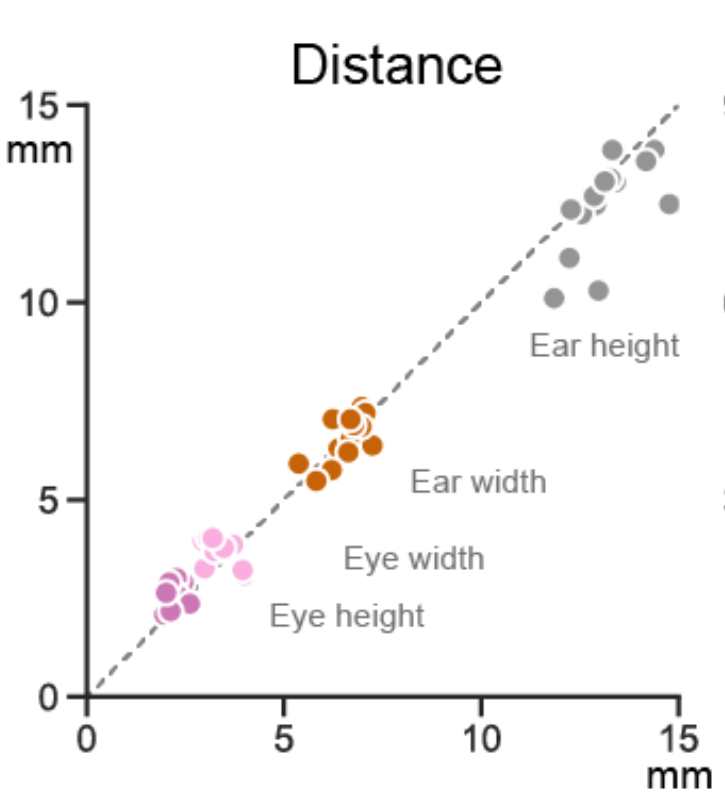
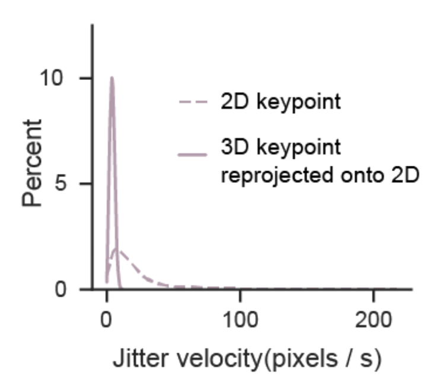
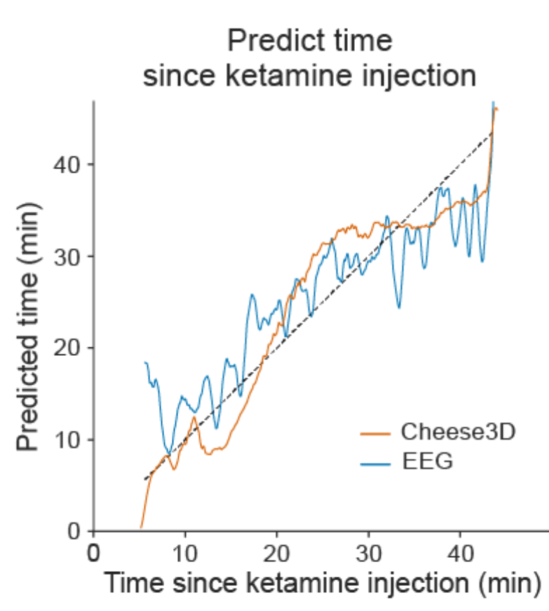
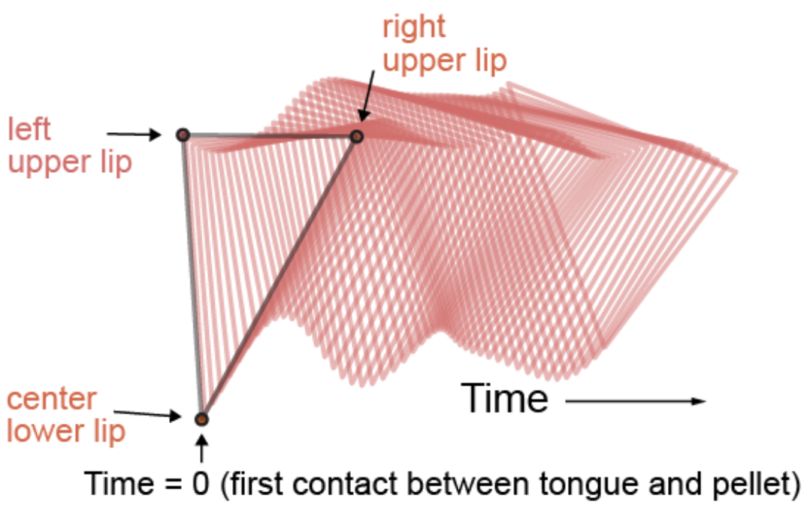
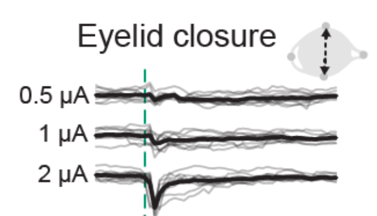
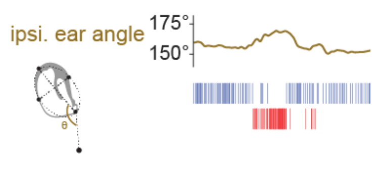

# Cheese3D

Cheese3D is a pipeline for tracking mouse facial movements built on top of existing tools like [DeepLabCut](https://github.com/DeepLabCut/DeepLabCut) and [Anipose](https://github.com/lambdaloop/anipose). By tracking anatomically-informed keypoints using multiple cameras registered in 3D, our pipeline produces sensitive, high-precision facial movement data that can be related internal state (e.g., electrophysiology).

<p align="center">
   
   
</p>

Using a combination of hardware synchronization signals and a multi-stage pipeline, we are able to precisely synchronize video and electrophysiology data. This allows us to relate spikes recorded in the brainstem to various facial movements (here, we highlight two example units correlated with ipsilateral ear movements).


<!-- If you use Cheese3D, please cite our preprint:
```
@article {Daruwalla2024.05.07.593051,
    author = {Daruwalla, Kyle and Martin, Irene Nozal and Frankel, Andrew and Nagli{\v c}, Diana and Ahmad, Zainab and Hou, Xun Helen},
    title = {A 3D whole-face movement analysis system to uncover underlying physiology in mice},
    elocation-id = {2024.05.07.593051},
    year = {2024},
    doi = {10.1101/2024.05.07.593051},
    publisher = {Cold Spring Harbor Laboratory},
    URL = {https://www.biorxiv.org/content/early/2024/05/08/2024.05.07.593051},
    eprint = {https://www.biorxiv.org/content/early/2024/05/08/2024.05.07.593051.full.pdf},
    journal = {bioRxiv}
}
``` -->

## Using Cheese3D

Follow the documentation by running:

1. Install [pixi](https://pixi.sh/latest/#installation)
2. Clone or download this repository
   (`git clone https://github.com/Hou-Lab-CSHL/cheese3d`)
3. Change directories to the repository folder
   (`cd <path to repo>/cheese3d`)
5. Open documentation (`pixi run docs-serve`)

## Reproducing Cheese3D paper figures

The following notebooks contain the code required to reproduce the figures in our paper. They also serve as a showcase of the type of analysis enabled by Cheese3D's output. You can find the complete collection under the `paper/` directory.

| Example figure panel | Notebook | Description |
|:--------------------:|:---------|:------------|
|  | [`paper/fig1-cheese3d-accuracy.ipynb`](paper/fig1-cheese3d-accuracy.ipynb) | Framework and validation of capturing face-wide movement as 3D geometric features in mice |
|  | [`paper/fig2-cheese3d-jitter-analysis.ipynb`](paper/fig2-cheese3d-jitter-analysis.ipynb) | Reduction in keypoint tracking jitter due to 3D triangulation of data from six camera views |
|  | [`paper/fig3-cheese3d-general-anesthesia-eeg.ipynb`](paper/fig3-cheese3d-general-anesthesia-eeg.ipynb) | Distinct facial patterns track time during induction and recovery from ketamine-induced anesthesia |
|  | [`paper/fig4-cheese3d-chewing-whole-face-kinematics.ipynb`](paper/fig4-cheese3d-chewing-whole-face-kinematics.ipynb) | Chewing kinematics in mouth and surrounding facial areas |
|  | [`paper/fig5-part1-cheese3d-stimulation-triggered-movement.ipynb`](paper/fig5-part1-cheese3d-stimulation-triggered-movement.ipynb) | Stimulation triggered facial movements in anesthetized mice |
|  | [`paper/fig5-part2-cheese3d-synchronized-electrophysiology.ipynb`](paper/fig5-part2-cheese3d-synchronized-electrophysiology.ipynb) | Synchronized Cheese3D with electrophysiology relates motor control activity to subtle facial movements |
