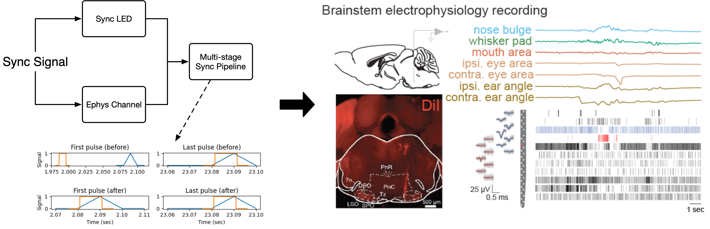

# Cheese3D

Cheese3D is a pipeline for tracking mouse facial movements built on top of existing tools like [DeepLabCut](https://github.com/DeepLabCut/DeepLabCut) and [Anipose](https://github.com/lambdaloop/anipose). By tracking anatomically-informed keypoints using multiple cameras registered in 3D, our pipeline produces sensitive, high-precision facial movement data that can be related internal state (e.g., electrophysiology).


Using a combination of hardware synchronization signals and a multi-stage pipeline, we are able to precisely synchronize video and electrophysiology data. This allows us to relate spikes recorded in the brainstem to various facial movements (here, we highlight two example units correlated with ipsilateral ear movements).



If you use Cheese3D, please cite our preprint:
```
@article {Daruwalla2024.05.07.593051,
    author = {Daruwalla, Kyle and Martin, Irene Nozal and Frankel, Andrew and Nagli{\v c}, Diana and Ahmad, Zainab and Hou, Xun Helen},
    title = {A 3D whole-face movement analysis system to uncover underlying physiology in mice},
    elocation-id = {2024.05.07.593051},
    year = {2024},
    doi = {10.1101/2024.05.07.593051},
    publisher = {Cold Spring Harbor Laboratory},
    URL = {https://www.biorxiv.org/content/early/2024/05/08/2024.05.07.593051},
    eprint = {https://www.biorxiv.org/content/early/2024/05/08/2024.05.07.593051.full.pdf},
    journal = {bioRxiv}
}
```

## Installation instructions

1. Install [pixi](https://pixi.sh/latest/#installation)
2. Clone or download this repository
   (`git clone https://github.com/Hou-Lab-CSHL/cheese3d`)
3. Change directories to the repository folder
   (`cd <path to repo>/cheese3d`)
4. Activate the environment (`pixi shell`)

## Run the demonstration notebook

First, download the demo dataset from LINK HERE.
Unpack the dataset:
```
tar -xvzf demo-data.tar.gz
```
Open the `demo.ipynb` notebook and run start to finish.

## DeepLabCut configuration

To train a DeepLabCut model on your own facial movement videos, please use the following project configuration parameters to match Cheese3D:
```yaml
# note that unspecified parameters are free to be set by the user
numframes2pick: 5
bodyparts:
- nose(bottom)
- nose(tip)
- nose(top)
- pad(top)(left)
- pad(side)(left)
- pad(center)
- pad(top)(right)
- pad(side)(right)
- lowerlip
- upperlip(left)
- upperlip(right)
- eye(front)(left)
- eye(top)(left)
- eye(back)(left)
- eye(bottom)(left)
- eye(front)(right)
- eye(top)(right)
- eye(back)(right)
- eye(bottom)(right)
- ear(base)(left)
- ear(top)(left)
- ear(tip)(left)
- ear(bottom)(left)
- ear(base)(right)
- ear(top)(right)
- ear(tip)(right)
- ear(bottom)(right)
- ref(head-post)
```

## Anipose configuration

Given a DLC model, to generate 3D keypoints using Anipose, please refer to the following project configuration parameters to match Cheese3D:
```toml
[labeling]
scheme = [ [ "nose(bottom)", "nose(tip)", "nose(top)", "nose(bottom)",], [ "pad(top)(left)", "pad(side)(left)", "pad(center)", "pad(top)(left)",], [ "pad(top)(right)", "pad(side)(right)", "pad(center)", "pad(top)(right)",], [ "lowerlip", "upperlip(left)", "upperlip(right)", "lowerlip",], [ "eye(front)(left)", "eye(top)(left)", "eye(back)(left)", "eye(bottom)(left)", "eye(front)(left)",], [ "eye(front)(right)", "eye(top)(right)", "eye(back)(right)", "eye(bottom)(right)", "eye(front)(right)",], [ "ear(base)(left)", "ear(top)(left)", "ear(tip)(left)", "ear(bottom)(left)", "ear(base)(left)",], [ "ear(base)(right)", "ear(top)(right)", "ear(tip)(right)", "ear(bottom)(right)", "ear(base)(right)",], [ "ref(head-post)",],]

[filter]
enabled = false
type = "medfilt"
medfilt = 13
offset_threshold = 5
score_threshold = 0.8
spline = false

[calibration]
board_type = "charuco"
board_size = [ 7, 7,]
board_marker_bits = 4
board_marker_dict_number = 50
board_marker_length = 4.5
board_square_side_length = 6

[triangulation]
triangulate = true
cam_regex = "_([LRCTB]{1,2})(?=_|$)"
manually_verify = false
axes = [ [ "z", "nose(top)", "nose(bottom)",], [ "x", "eye(front)(left)", "eye(front)(right)",],]
reference_point = "ref(head-post)"
optim = true
score_threshold = 0.9
scale_smooth = 0.0
```
