# Cheese3D

[](https://hou-lab-cshl.github.io/cheese3d/)
[](https://labshare.cshl.edu/shares/houlab/www-data/cheese3d_paper_data/cheese3d_demo.tar.gz)
<!--[Download demo data](https://labshare.cshl.edu/shares/houlab/www-data/cheese3d_paper_data/cheese3d_demo.tar.gz)-->

Cheese3D is a pipeline for tracking mouse facial movements built on top of existing tools like [DeepLabCut](https://github.com/DeepLabCut/DeepLabCut) and [Anipose](https://github.com/lambdaloop/anipose). By tracking anatomically-informed keypoints using multiple cameras registered in 3D, our pipeline produces sensitive, high-precision facial movement data that can be related internal state (e.g., electrophysiology).

<p align="center">
   
   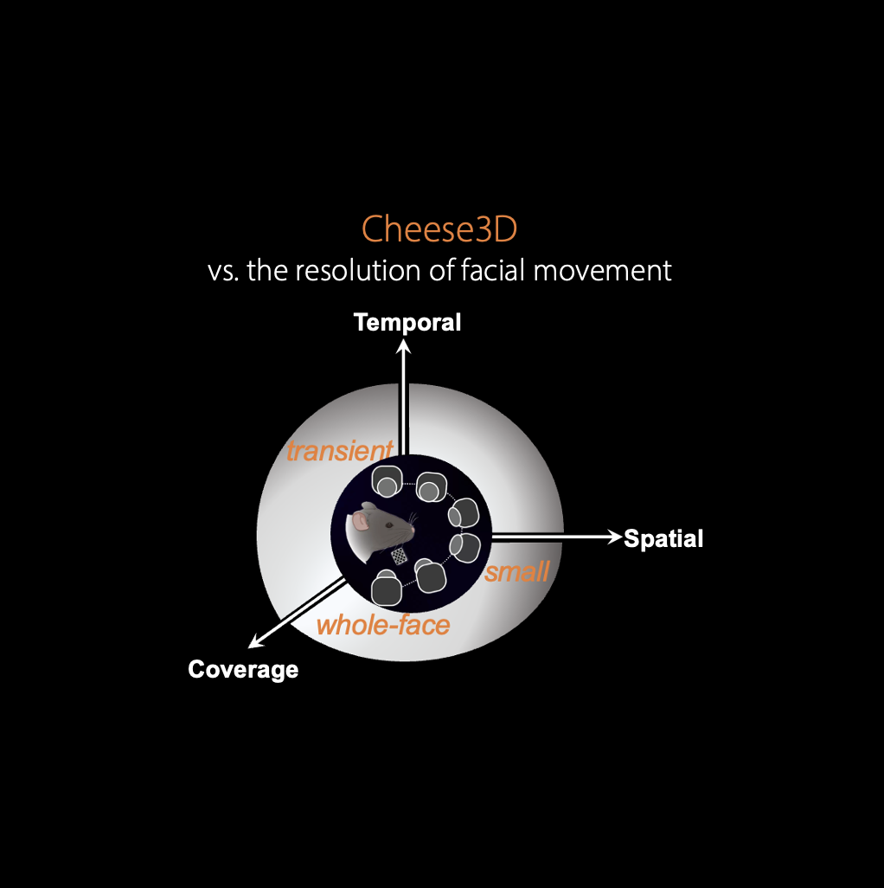
</p>

Cheese3D output can be visualized interactively.

<p align="center">
   
   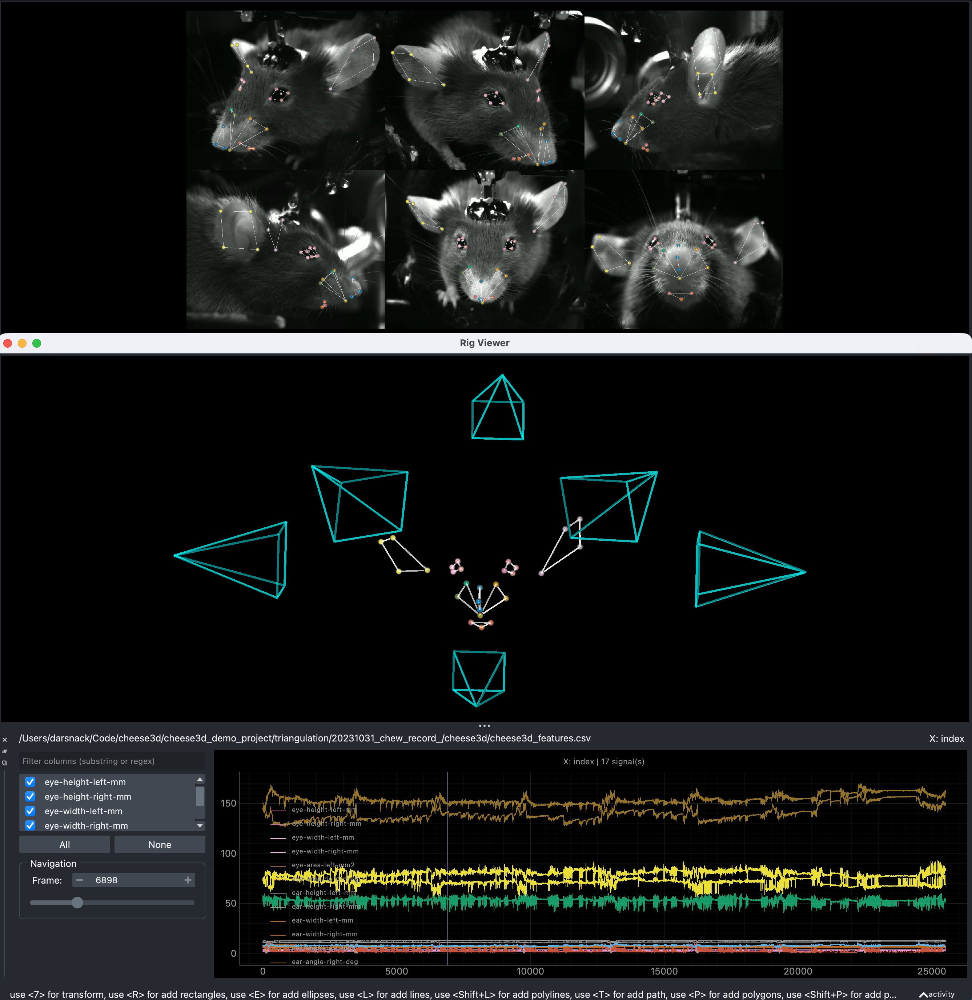
</p>

Using a combination of hardware synchronization signals and a multi-stage pipeline, we are able to precisely synchronize video and electrophysiology data. This allows us to relate spikes recorded in the brainstem to various facial movements (here, we highlight two example units correlated with ipsilateral ear movements).

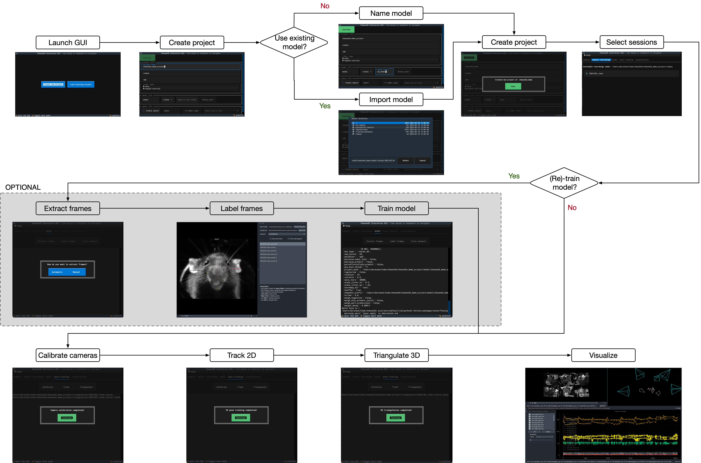

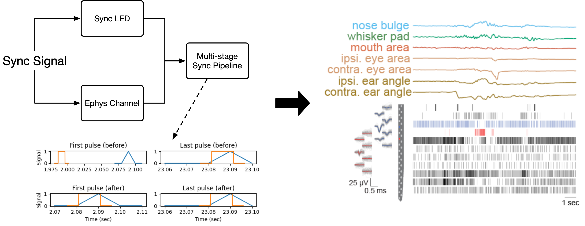

 If you use Cheese3D, please cite our preprint:
```
@article {Daruwalla2024.05.07.593051,
 	author = {Daruwalla, Kyle and Martin, Irene Nozal and Zhang, Linghua and Nagli{\v c}, Diana and Frankel, Andrew and Rasgaitis, Catherine and Zhang, Xinyan and Ahmad, Zainab and Borniger, Jeremy C. and Hou, Xun Helen},
 	title = {Cheese3D: Sensitive Detection and Analysis of Whole-Face Movement in Mice},
 	elocation-id = {2024.05.07.593051},
 	year = {2025},
 	doi = {10.1101/2024.05.07.593051},
 	publisher = {Cold Spring Harbor Laboratory},
 	URL = {https://www.biorxiv.org/content/early/2025/03/01/2024.05.07.593051},
 	eprint = {https://www.biorxiv.org/content/early/2025/03/01/2024.05.07.593051.full.pdf},
 	journal = {bioRxiv}
}
```

## Reproducing Cheese3D paper figures

The following notebooks contain the code required to reproduce the figures in our paper. They also serve as a showcase of the type of analysis enabled by Cheese3D's output. You can find the complete collection under the [`paper/`](/paper/) directory.

| Example figure panel | Notebook | Description |
|:--------------------:|:---------|:------------|
| 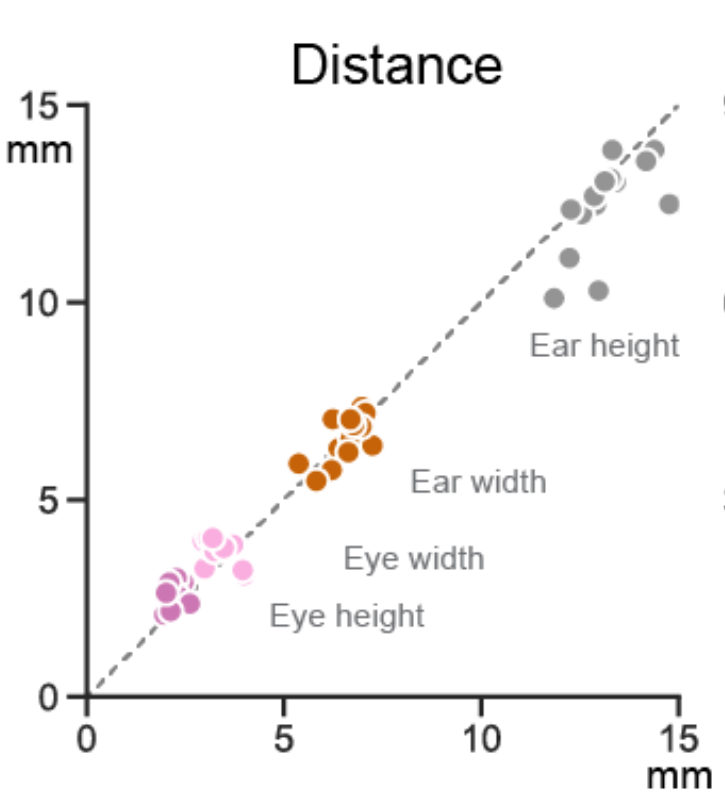 | `paper/fig1-cheese3d-accuracy.ipynb` | Framework and validation of capturing face-wide movement as 3D geometric features in mice |
| 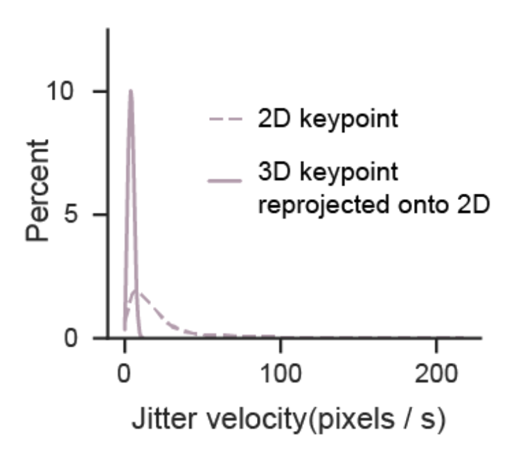 | `paper/fig2-cheese3d-jitter-analysis.ipynb` | Reduction in keypoint tracking jitter due to 3D triangulation of data from six camera views |
| 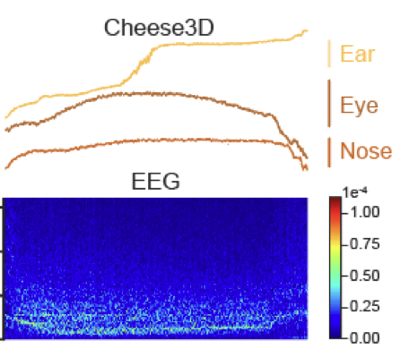 | `paper/fig3-part1-cheese3d-general-anesthesia-eeg.ipynb` | Distinct facial patterns track time during induction and recovery from ketamine-induced anesthesia |
| 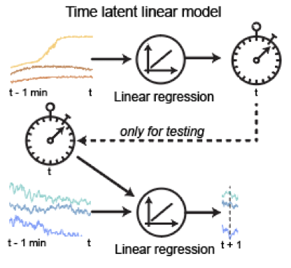 | `paper/fig3-part2-prediction-of-eeg-from-facial-features.ipynb` | Predicting EEG frequency band power from facial features |
|  | `paper/fig4-part1-chewing-whole-face-kinematics.ipynb` | Chewing kinematics in mouth and surrounding facial areas |
| 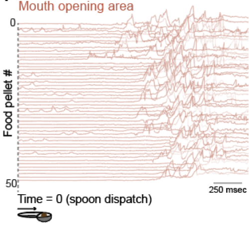 | `paper/fig4-part2-consummatory-behavior.ipynb` | Changes in consummatory behavior measured by Cheese3D features |
| 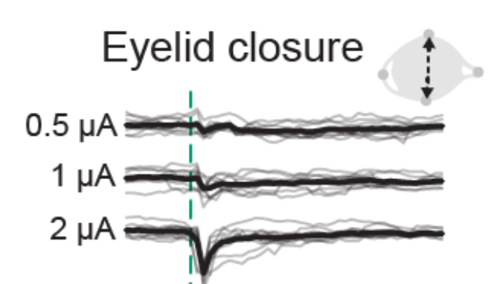 | `paper/fig5-part1-cheese3d-stimulation-triggered-movement.ipynb` | Stimulation triggered facial movements in anesthetized mice |
| 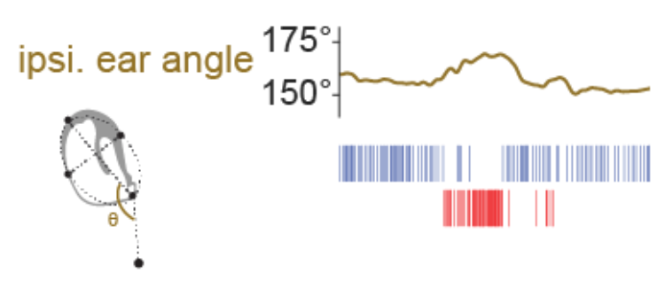 | `paper/fig5-part2-cheese3d-synchronized-electrophysiology.ipynb` | Synchronized Cheese3D with electrophysiology relates motor control activity to subtle facial movements |
|  | `paper/fig5-part3-prediction-of-neural-activity-from-cheese3d.ipynb` | Predicting neural activity of brainstem units from single facial features |

## System Requirements

Cheese3D is supported on most Linux and macOS systems (including GPU support for CUDA and Apple Silicon). Partial support is available on Windows. For details, please refer to [our documentation](https://hou-lab-cshl.github.io/cheese3d/guides/installation.html#platform-specific-support).

Software dependencies are listed in the [pixi.toml](/pixi.toml), [`cheese3d` pyproject.toml](/packages/cheese3d/pyproject.toml), and [`cheese3d-annotator` pyproject.toml](/packages/cheese3d-annotator/pyproject.toml) files. Hardware specifications can be found in [our hardware guide](https://hou-lab-cshl.github.io/cheese3d/guides/hardware.html).
