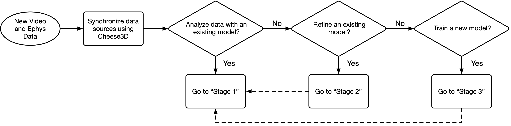

# Cheese3D

Cheese3D is a pipeline for tracking mouse facial movements built on top of existing tools like [DeepLabCut](https://github.com/DeepLabCut/DeepLabCut) and [Anipose](https://github.com/lambdaloop/anipose). By tracking anatomically-informed keypoints using multiple cameras registered in 3D, our pipeline produces sensitive, high-precision facial movement data that can be related internal state (e.g., electrophysiology).

<p align="center">
   
</p>

Using a combination of hardware synchronization signals and a multi-stage pipeline, we are able to precisely synchronize video and electrophysiology data. This allows us to relate spikes recorded in the brainstem to various facial movements (here, we highlight two example units correlated with ipsilateral ear movements).


<!-- If you use Cheese3D, please cite our preprint:
```
@article {Daruwalla2024.05.07.593051,
    author = {Daruwalla, Kyle and Martin, Irene Nozal and Frankel, Andrew and Nagli{\v c}, Diana and Ahmad, Zainab and Hou, Xun Helen},
    title = {A 3D whole-face movement analysis system to uncover underlying physiology in mice},
    elocation-id = {2024.05.07.593051},
    year = {2024},
    doi = {10.1101/2024.05.07.593051},
    publisher = {Cold Spring Harbor Laboratory},
    URL = {https://www.biorxiv.org/content/early/2024/05/08/2024.05.07.593051},
    eprint = {https://www.biorxiv.org/content/early/2024/05/08/2024.05.07.593051.full.pdf},
    journal = {bioRxiv}
}
``` -->

## Table of contents

1. [Reproducing Cheese3D paper figures](#reproducing-cheese3d-paper-figures)
2. [Software pipeline installation instructions](#software-pipeline-installation-instructions)
3. [Hardware setup guide](#hardware-setup-guide)
4. [Software pipeline usage guide](#software-pipeline-usage-guide)

## Reproducing Cheese3D paper figures

The following notebooks contain the code required to reproduce the figures in our paper. They also serve as a showcase of the type of analysis enabled by Cheese3D's output. You can find the complete collection under the `paper/` directory.

| Example figure panel | Notebook | Description |
|:--------------------:|:---------|:------------|
|  | `paper/Figure1.ipynb` | Framework and validation of capturing face-wide movement as 3D geometric features in mice |
|  | `paper/Figure2.ipynb` | Reduction in keypoint tracking jitter due to 3D triangulation of data from six camera views |
|  | `paper/Figure3.ipynb` | Distinct facial patterns track time during induction and recovery from ketamine-induced anesthesia |
|  | `paper/Figure4.ipynb` | Chewing kinematics in mouth and surrounding facial areas |
|  | `paper/Figure5-Part1.ipynb` | Stimulation triggered facial movements in anesthetized mice |
|  | `paper/Figure5-Part2.ipynb` | Synchronized Cheese3D with electrophysiology relates motor control activity to subtle facial movements |

## Software pipeline installation instructions

1. Install [pixi](https://pixi.sh/latest/#installation)
2. Clone or download this repository
   (`git clone https://github.com/Hou-Lab-CSHL/cheese3d`)
3. Change directories to the repository folder
   (`cd <path to repo>/cheese3d`)
4. Activate the environment (`pixi shell`)

## Hardware setup guide

This section contains information about:
- The [camera set-up](#camera-set-up) of a Cheese3D rig.
- The [spatio-temporal synchronization](#synchronization) protocol.
- The [head-fixation](#head-fixation) design.

### Camera set-up

Six high-speed monochrome cameras were used to record the video data at `100 fps`. See the table below for the part list of a Cheese3D camera set-up:


Placing the cameras at the recommended locations will result in the following keypoints visible by each camera view. See **Supplementary Table 1** from manuscript below:


Illumination inside the rig is achieved with infrarred lamps (see [these](https://www.amazon.com/CMVision-IR30-WideAngle-IR-Illuminator/dp/B001P2E4U4) from Amazon as an example). 

### Synchronization

Cameras are temporally synchronized with an infrarred LED that is visible from the six views. The LED (see [these](https://www.mouser.com/ProductDetail/ROHM-Semiconductor/SML-S15R2TT86?qs=BJlw7L4Cy7%2F7%2FlWhZxGloQ%3D%3D) from Mouser as an example) turns on for `20 ms` every `10 ± 0.5 s`. The pulse is sent by an [Arduino MEGA](https://store.arduino.cc/products/arduino-mega-2560-rev3) and is detected on each view post-hoc through our pipeline (refer to the Methods section **Video capture, synchronization, and 3D calibration system** in our manuscript for more information).

Spatial synchronization is achieved with a manufactured calibration board with a standard [ChArUco template](https://github.com/dogod621/OpenCVMarkerPrinter) imprinted on its surface. We used `7 × 7` ChArUco board (`4.5 mm` marker length, `6 mm` square side length, ArUco dictionary DICT_4x4_50). Before and after each experimental recording, the ChaRuCo board is placed inside the rig by the experimenter, while rotating over the camera views and making sure it stays on focus.

### Head-fixation

To acquire high-resolution facial video while maintaining comfort for natural behavior, mice are acclimated to sitting in a tunnel with the head secured using a lightweight headpost, custom-designed to allow unobstructed viewing of all facial areas.

See below the headpost and tunnel models (note the parts are not to scale, we recommend referring to the manuscript or the .STL files in this folder for the true measurements).


## Software pipeline usage guide

This guide provides an overview of the Cheese3D workflow including analyzing new data and training new models. We provide example projects and datasets to walk through this tutorial.

> [!IMPORTANT]
> Before starting, make sure you have installed Cheese3D as described in the [README](README.md).

Download the example projects and datasets HERE. Unpack the downloaded archive using:
```bash
tar -xvzf cheese3d_examples.tar.gz
```

Use the flow chart below to guide you through the workflow.


### Stage 1: Analyzing new videos

Suppose you have new video data that you wish to analyze with Cheese3D. Start by placing the videos in `video-data` in their own subfolder. For this tutorial, we already provide a dataset called `20231031_B6-B20-B21-B26-B31-B32-B33_chew_rig2` as an example.

Next, create an Anipose project configuration for your new data under `configs/anipose`. We provide `configs/anipose/example-anipose.yaml` as a reference. Let's go over the parts of this template that you should customize.

First, the following keys specify the name of your Anipose project and a path to a DLC project to use for analysis:
```yaml
name: example-anipose
dlc_model: ${paths.dlc.projects}/example-dlc-defaultuser-2023-12-14
```
These can be any name and path that you want (as long as it points to a valid DLC model). In this example, we use the name and model path for the projects provided by the example data that you previously downloaded.

Next, you should add an entry for the new data that you want to analyze. For example, we can refer to the entry for the `20231031_B6-B20-B21-B26-B31-B32-B33_chew_rig2` dataset:
```yaml
sessions:
- name: 20231031_B6-B20-B21-B26-B31-B32-B33_chew_rig2
  mouse: B6
  condition: bl
  cal_run: "001"
```
The `name` key specifies the subfolder in `video-data` that you want to analyze. Since each subfolder in `video-data` may contain recordings for many mice, conditions, and runs, we specify the `mouse` and `condition` keys to choose a specific recording. We also specify the `cal_run` key to choose a specific calibration recording.

> [!TIP]
> You do not need to create a new Anipose configuration for each dataset. You can add as many entries to the `sessions` list as you want, and you can update it even after you have started the analysis.

Now that you have an Anipose configuration, you can create or update the Anipose project by running:
```bash
python run-anipose.py anipose=example-anipose setupproject=true
```
We specify the `anipose=` flag to indicate which configuration file should be used. This will create a new project with the name specified in the configuration file under `anipose-projects`. In our case, there is already an existing project provided in the examples download that has already been created and analyzed.

From here, we can proceed with analysis:
```bash
python run-anipose.py anipose=example-anipose run_data=true
```
If data has already been analyzed, it will be skipped.

### Stage 2: Training a new model

Sometimes, we may not have an existing  model ready to use. In this case, we can train a new DeepLabCut (DLC) model through Cheese3D. Start by placing the videos used for training in `video-data` in their own subfolder. For this tutorial, we already provide a dataset called `20231031_B6-B20-B21-B26-B31-B32-B33_chew_rig2` as an example.

Next, create a new DLC project configuration under `configs/dlc`. We provide `configs/dlc/example-dlc.yaml` as a reference. Let's go over the parts of this template that you should customize.

The `name` key specifies the name of your project:
```yaml
name: example-dlc
```
In this case, we use the name of the example project provided in the examples download.

The `sessions` list provides data from `video-data` to use for training the model:
```yaml
sessions:
# chewing rig 2
- name: 20231031_B6-B20-B21-B26-B31-B32-B33_chew_rig2
  concat_videos: true
```
The `name` key specifies the subfolder in `video-data` to use. Typically, there are many recordings in the same subfolder. Just like in [the Anipose configuration example above](#stage-1-analyzing-new-videos), you can specify keys like `mouse`, `condition`, or `run` to narrow down which data to use. Alternatively, you can specify none of these keys to use all the data, and each unique recording will correspond to a separate video in the DLC project. In this case, we use the `concat_videos: true` option to merge all the recordings into a single video. DLC operates frame by frame, so it does not matter that these videos are discontinuous in time.

Finally, notice at the top of the file that we have some defaults specified:
```yaml
defaults:
- /labutils/dlcconfig@_here_
- common
- _self_
```
The first an last entry are required for Cheese3D to function; however, the middle entry imports a set of common configurations which you can find under `configs/dlc/common.yaml`. You can override any of these settings by specifying the same key in `configs/dlc/<your-project-name>.yaml`.

Once we have a configuration, we can proceed with setting up the project, extracting frames to label, labeling frames, and training the model.

> [!CAUTION]
> Since we already provided an example DLC project, running the following commands on the example project will modify the model.

Run through the following steps:
1. Create the project with `python run-dlc.py dlc=example-dlc setupproject=true`
2. Extract frames to label with `python run-dlc.py dlc=example-dlc extractframes=true`
3. Label frames with `python run-dlc.py dlc=example-dlc labelframes=true`
4. Build the dataset with `python run-dlc.py dlc=example-dlc builddataset=true`
5. Train the model with `python run-dlc.py dlc=example-dlc trainnetwork=true evaluatenetwork=true`

Now you should have a trained DLC model!

### Stage 3: Refining an existing model

After running Anipose analysis, you may wish to refine the DLC model using your new or existing data.

1. First, extract frames to label using DLC's active learning with `python run-dlc.py dlc=example-dlc extractframes=true` (Cheese3D will detect a trained model and use it to extract frames)
2. Label frames with `python run-dlc.py dlc=example-dlc labelframes=true`
3. Update the dataset with `python run-dlc.py dlc=example-dlc mergedataset=true`
4. Retrain or refine the model:
    1. Retrain the model with `python run-dlc.py dlc=example-dlc trainnetwork=true evaluatenetwork=true`
    2. Refine the model with `python run-dlc.py dlc=example-dlc initweights=true` then `python run-dlc.py dlc=example-dlc trainnetwork=true evaluatenetwork=true`
