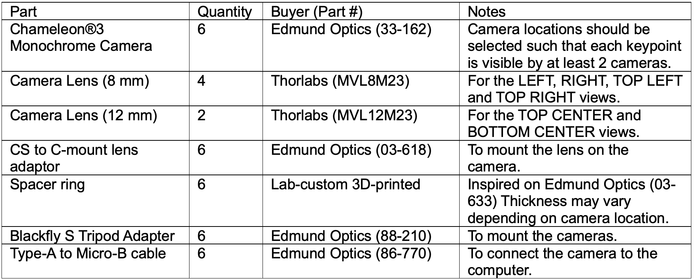
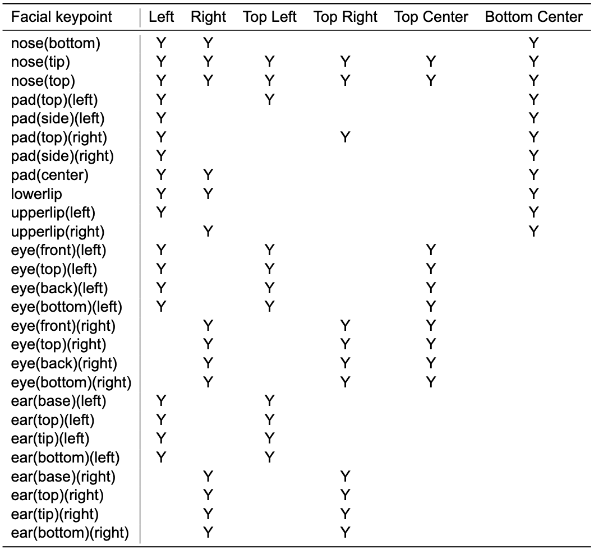
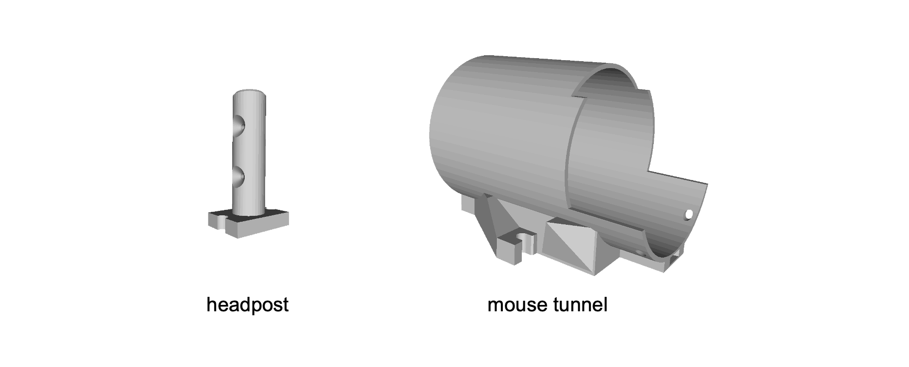

<!--
TODO: Fill in the details of the hardware protocol for Cheese3D.
- CONE Add STL file for headpost design & picture
- DONE Add ChaRuCo marker design
- DONE Add description of rig setup
    - table: parts list for Cheese3D (rig2 specifically): see updated yellow tab (https://docs.google.com/spreadsheets/d/13R9PtIZJ4nx72vV8oIzqA-8vUrAW3IE-dqtb1uiIOvg/edit?gid=0#gid=0)
    - supp table 1 (which camera sees what face parts) 
-->
# Cheese3D Hardware Protocol
This README file contains information about:
- The [camera set-up](#camera-set-up) of a Cheese3D rig.
- The [spatio-temporal synchronization](#synchronization) protocol.
- The [head-fixation](#head-fixation) design.

## Camera set-up

Six high-speed monochrome cameras were used to record the video data at `100 fps`. See the table below for the part list of a Cheese3D camera set-up:

Placing the cameras at the recommended locations will result in the following keypoints visible by each camera view. See **Supplementary Table 1** from manuscript below:

Illumination inside the rig is achieved with infrarred lamps (see [these](https://www.amazon.com/CMVision-IR30-WideAngle-IR-Illuminator/dp/B001P2E4U4) from Amazon as an example). 

## Synchronization

Cameras are temporally synchronized with an infrarred LED that is visible from the six views. The LED (see [these](https://www.mouser.com/ProductDetail/ROHM-Semiconductor/SML-S15R2TT86?qs=BJlw7L4Cy7%2F7%2FlWhZxGloQ%3D%3D) from Mouser as an example) turns on for `20 ms` every `10 ± 0.5 s`. The pulse is sent by an [Arduino MEGA](https://store.arduino.cc/products/arduino-mega-2560-rev3) and is detected on each view post-hoc through our pipeline (refer to the Methods section **Video capture, synchronization, and 3D calibration system** in our manuscript for more information).

Spatial synchronization is achieved with a manufactured calibration board with a standard [ChArUco template](https://github.com/dogod621/OpenCVMarkerPrinter) imprinted on its surface. We used `7 × 7` ChArUco board (`4.5 mm` marker length, `6 mm` square side length, ArUco dictionary DICT_4x4_50). Before and after each experimental recording, the ChaRuCo board is placed inside the rig by the experimenter, while rotating over the camera views and making sure it stays on focus.

## Head-fixation

To acquire high-resolution facial video while maintaining comfort for natural behavior, mice are acclimated to sitting in a tunnel with the head secured using a lightweight headpost, custom-designed to allow unobstructed viewing of all facial areas.

See below the headpost and tunnel models (note the parts are not to scale, we recommend referring to the manuscript or the .STL files in this folder for the true measurements).

