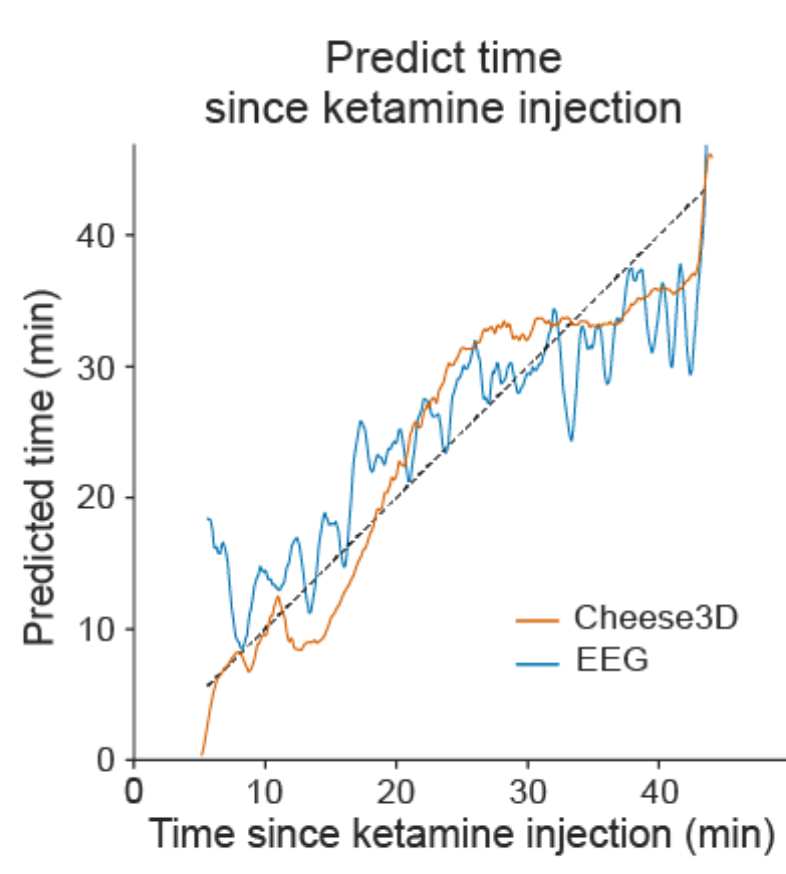
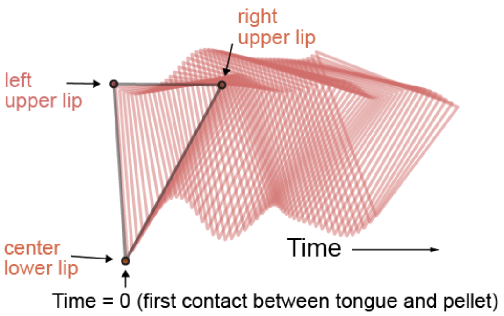

# Cheese3D Paper Figure Notebooks

The following notebooks can be used to generate the figures in our paper, provided that the required datasets are available (details in each notebook). See the descriptions below.

## Reproducing Cheese3D paper figures

The following notebooks contain the code required to reproduce the figures in our paper. They also serve as a showcase of the type of analysis enabled by Cheese3D's output. You can find the complete collection under the `paper/` directory.

| Example figure panel | Notebook | Description |
|:--------------------:|:---------|:------------|
|  | `fig1-cheese3d-accuracy.ipynb` | Framework and validation of capturing face-wide movement as 3D geometric features in mice |
|  | `fig2-cheese3d-jitter-analysis.ipynb` | Reduction in keypoint tracking jitter due to 3D triangulation of data from six camera views |
|  | `fig3-cheese3d-general-anesthesia-eeg.ipynb` | Distinct facial patterns track time during induction and recovery from ketamine-induced anesthesia |
|  | `fig4-cheese3d-chewing-whole-face-kinematics.ipynb` | Chewing kinematics in mouth and surrounding facial areas |
|  | `fig5-part1-cheese3d-stimulation-triggered-movement.ipynb` | Stimulation triggered facial movements in anesthetized mice |
|  | `fig5-part2-cheese3d-synchronized-electrophysiology.ipynb` | Synchronized Cheese3D with electrophysiology relates motor control activity to subtle facial movements |
